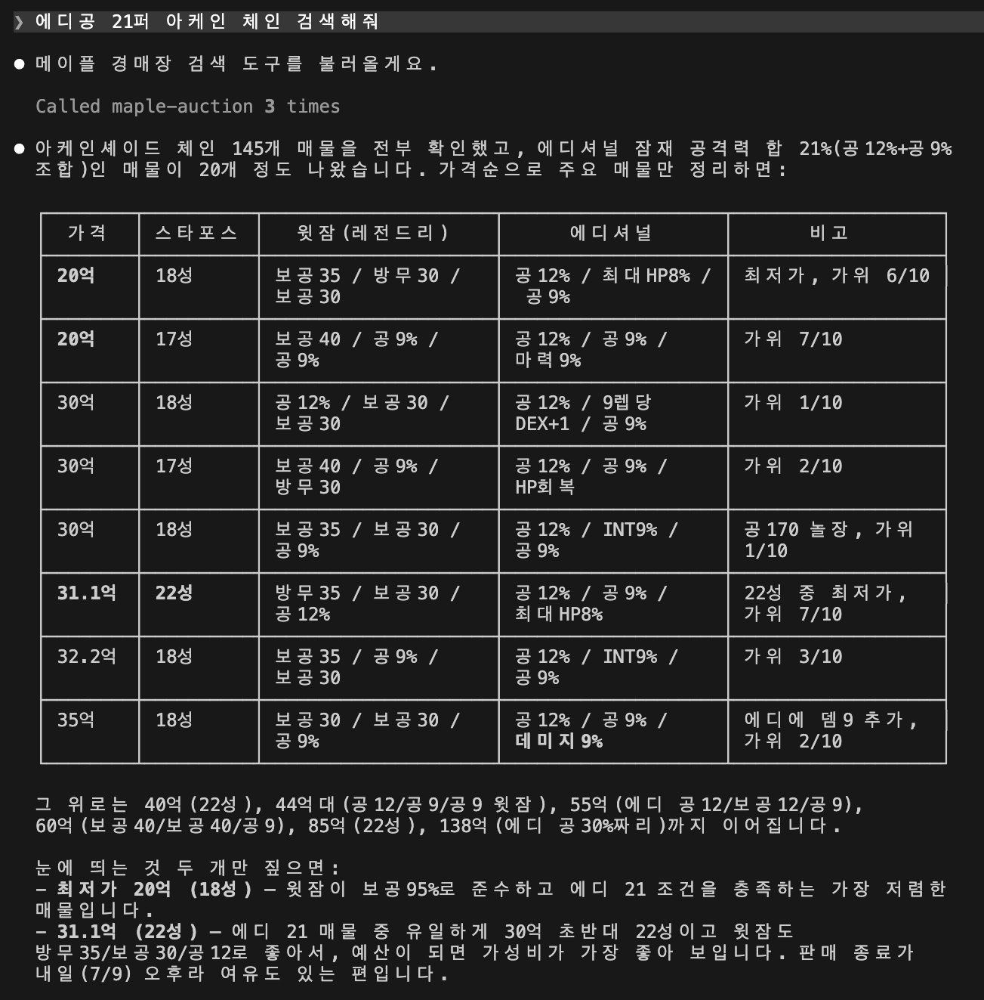

# Maple Auction MCP

메이플스토리 경매장을 검색하는 MCP 서버.

## 설치 방법

먼저 [크롬 확장](https://chromewebstore.google.com/)을 설치하고, 크롬에서 [넥슨에 로그인](https://nxlogin.nexon.com/auth/login)해 주세요.

### Claude Code

```bash
claude mcp add --scope user maple-auction -- npx -y maple-auction-mcp
```

Claude Desktop은 `claude_desktop_config.json`에 추가:

```json
{
  "mcpServers": {
    "maple-auction": {
      "command": "npx",
      "args": ["-y", "maple-auction-mcp"]
    }
  }
}
```

### Codex

```bash
codex mcp add maple-auction -- npx -y maple-auction-mcp
```

## 사용 예

> 에디공 21퍼 아케인 체인 검색해줘



## 개인정보 처리방침

크롬 확장은 어떠한 데이터도 외부로 수집·전송하지 않습니다. 자세한 내용은 [개인정보 처리방침](docs/privacy-policy.md)을 참고하세요.

## 라이선스

[MIT](LICENSE)